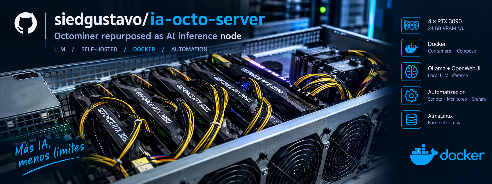

# Octoserver · From mining rig to local AI

**Four RTX 3090s. 96 GiB of VRAM. A second life for an Octominer.**

[](#the-hardware)
[](#the-hardware)
[](#services)
[](#what-it-does)

A mining chassis gets a new job: running large language models locally, with its
own cooling control, hardware watchdog, live dashboards and an OLED status display.
**The GPUs do the inference. The rest of the stack keeps the machine running.**

This repository contains the Octofan AI Server stack, hardware notes and performance
experiments behind Octoserver. Including the experiments that proved our first
explanation wrong.

**[Explore the benchmarks](#measured-not-just-built)** ·
**[Get started](#quick-start)** ·
**[Read the architecture](docs/architecture.md)** ·
**[Browse the docs](#documentation)**

## Measured, not just built

Results recorded on September 11, 2026, after upgrading all four GPU links to
PCIe Gen3 x8:

| Workload | Result | What it means |
|---|---:|---|
| gpt-oss-120b MXFP4, Ollama, ~2k prompt | **104 tokens/s** generation | A 120B-class model running entirely on the GPUs |
| Qwen3.8-Flash-Next, llama.cpp, ~4k prompt | **901 tokens/s** prompt · **51 tokens/s** generation | The dedicated local inference service |
| GLM-5.3-Flash IQ1_S, auto-fit, ~4k prompt | **227 tokens/s** prompt · **21.5 tokens/s** generation | A larger MoE model using GPU memory plus CPU offload |

### How does it compare with a DGX Spark?

Our gpt-oss-120b run recorded **104 tokens/s**, versus **58.7 tokens/s** in the
published llama.cpp DGX Spark reference: an observed **1.8× difference**.

That's a compelling result for repurposed hardware, but **not a controlled
hardware shootout**: our run used Ollama and its GGUF conversion; the Spark
reference used llama-bench, a different build and different context handling.
These measurements do not establish a universal speed advantage. Nor do they
establish a tokens-per-watt winner: our power samples were not synchronized with
a matching Spark measurement.

**[Read the comparison, measurements and limitations →](docs/octoserver-vs-dgx-spark.md)**

### The tuning lessons were just as useful

- **New risers helped, but tensor split still lost.** Layer split delivered
  2.26× the prompt throughput and 2.54× the generation throughput of the tested
  tensor configuration. [Results →](docs/qwen38flash-split-benchmark.md)
- **More GPUs only help if their memory gets used.** One manual GLM placement
  left GPU 0 and GPU 1 almost empty. Auto-fit made substantially better use of
  the available VRAM. [Results →](docs/glm53flash-benchmark.md)
- **Capacity and speed are different constraints.** A model fitting entirely
  on the GPUs behaves very differently from one that needs CPU offload.

## The hardware

| Component | Octoserver |
|---|---|
| Chassis | Repurposed Octominer / Octofan mining enclosure |
| GPUs | **4 × NVIDIA RTX 3090**, 24 GiB each, Ampere |
| GPU links | PCIe Gen3 x8 per card, direct CPU root ports |
| GPU peer-to-peer | Unavailable in the measured configuration |
| CPU | 2 × Intel Xeon E5-2680 v4, 28 cores / 56 threads total |
| Host memory | Approximately 125 GiB reported by the OS |
| Storage | Samsung 980 PRO 2 TB NVMe |
| Deployment | Docker Compose; Ollama and dedicated llama.cpp services |

The 96 GiB of VRAM is distributed across four cards, not a single unified memory
pool. Model placement, KV cache and temporary buffers all matter.

## More than a model server

The stack keeps the original `fan_controller_cli` binary as the hardware interface
and replaces the HiveOS scripts with a Python/FastAPI controller, Prometheus
metrics and provisioned Grafana dashboards. It connects inference software to the
physical machine: temperatures, power supplies, fans, LEDs and watchdog recovery.

The original HiveOS package files are preserved as reference material under
`reference/octofan-hiveos-originals/`.

## What It Does

- Reads Octofan controller telemetry through the original USB CLI.
- Controls chassis fans from internal case temperature.
- Exposes all controller telemetry as Prometheus metrics.
- Adds NVIDIA GPU telemetry from `nvidia-smi`.
- Adds host CPU, memory, disk and network telemetry through node exporter.
- Ships Grafana dashboards for overview, PSUs, environment, cooling, GPUs, host/network, watchdog and AI metrics.
- Updates the controller OLED with host, thermal, power and AI status.
- Drives the front-panel LEDs from controller health and GPU activity.
- Feeds the hardware watchdog only when configured host checks pass.
- Runs Ollama with every NVIDIA GPU visible and on-demand model scheduling.

## Services

- `octofan-controller`: FastAPI daemon, UI, REST API, Prometheus exporter, fan control, watchdog and OLED updates.
- `prometheus`: metrics storage.
- `node-exporter`: host system and network metrics, running in the host network namespace.
- `grafana`: dashboard at `http://localhost:3000` (`admin` / `octofan`).
- `ollama`: on-demand Ollama API at `http://localhost:11434`, with every host GPU visible.
- `qwen38flash`: dedicated llama.cpp service on port `8091`, defined in `docker-compose.qwen38flash.yml`.
- `glm53flash`: dedicated llama.cpp service on port `8090`, defined in `docker-compose.glm53flash.yml`.

The dedicated inference services use separate Compose files and compete for the
same GPU memory. The benchmarks above ran them individually.

## Repository Layout

- `controller/`: Python FastAPI controller service.
- `config/octofan.yaml`: mounted runtime configuration.
- `grafana/`: provisioned datasource and dashboard.
- `prometheus/prometheus.yml`: scrape configuration.
- `reference/octofan-hiveos-originals/`: original HiveOS files retained for reference.
- `tests/`: parser, control, display and API tests.
- `llamacpp/`: inference images and KV-cache persistence entrypoint.
- `ollama/`: model manifests and Ollama integration.
- `docs/`: benchmarks, hardware investigations and operating notes.
- `tools/expert-profiler/`: MoE expert profiling experiments.

## Quick Start

Optional: copy `.env.example` to `.env` and adjust ports or mock mode.

```bash
docker compose up --build
```

Open:

- Controller UI: `http://localhost:8000`
- Prometheus: `http://localhost:9090`
- Grafana: `http://localhost:3000`
- Ollama: `http://localhost:11434`

Grafana provisions these dashboards under the `Octofan` folder:

- `Octofan - Overview`
- `Octofan - Power Supplies`
- `Octofan - Environment`
- `Octofan - Cooling`
- `Octofan - GPUs`
- `Octofan - Host and Network`

To test without Octofan hardware:

```bash
OCTOFAN_MOCK=1 docker compose up --build
```

If the default UI ports are already in use:

```bash
OCTOFAN_MOCK=1 OCTOFAN_CONTROLLER_PORT=18000 PROMETHEUS_PORT=19090 GRAFANA_PORT=13000 docker compose up --build
```

## AlmaLinux 10 Notes

The controller container is privileged and mounts `/dev/bus/usb` because the original CLI uses libusb to talk to the Octofan controller. Keep the stack on a trusted LAN; v1 intentionally has no authentication on the controller UI/API.

Configuration lives in `config/octofan.yaml`.

## Configuration

The controller watches the mounted YAML at startup. Restart `octofan-controller` after manual edits:

```bash
docker compose restart octofan-controller
```

Important sections:

- `fans`: auto/manual mode, target temperature, min/max fan limits and fail-safe speed.
- `watchdog`: hardware watchdog timeouts and HTTP/TCP health checks.
- `display`: OLED profile and refresh interval.
- `leds`: front-panel LED policy. By default LED `0` is orange warning, LED `1` is blue online and LED `2` is white activity.
- `llamacpp`: optional legacy health polling; disabled when Ollama is the only inference service.
- `ollama`: on-demand inference health polling (`enabled`, `base_url`, `timeout_seconds`). When enabled, the controller polls Ollama and reflects it in `/api/status`, the OLED `ai` profile and the online/warning LEDs.

Automatic fan control combines BME280 intake, exhaust, exhaust-minus-intake delta and a capped
hottest-GPU assistance curve, then applies the highest demand. Chassis temperatures govern normal
airflow; GPU temperature only contributes above 75C and cannot request more than 40% before the
88C emergency threshold. Invalid sensors are filtered independently, while critical temperatures
override normal slew limits. The API, Prometheus and Cooling dashboard expose each signal's demand.

`fans.gpu_idle_stop_enabled` can hold the chassis fans at the lowest active configured speed while NVIDIA GPUs are idle and cool. Manual and automatic targets are clamped to `fans.min_percent..fans.max_percent`, and the idle policy falls back to the normal auto curve when GPU load, GPU temperature, intake temperature or telemetry health no longer matches the configured idle thresholds.

The OLED `ai` profile shows the host IP, AI health (`Ollama N models loaded`, `Ollama DOWN`, `AI services OK` or `AI monitor off`), hottest-GPU temperature and load, intake temperature with the current fan percent, and total power. The host IP is auto-detected from the host hostname and `/etc/hosts` (both mounted read-only into the controller); set `OCTOFAN_DISPLAY_IP` in `.env` to pin a specific address.

## API

- `GET /api/status`
- `GET /api/config`
- `PUT /api/config`
- `POST /api/fans/manual`
- `POST /api/fans/auto`
- `POST /api/display/render`
- `POST /api/watchdog/test`
- `POST /api/calibrate-fans`
- `GET /metrics`

## Ollama

The stack includes one Ollama instance with every NVIDIA GPU on the host visible. It processes one request
per model in parallel, packs a model into one GPU whenever it fits, uses a 4-bit KV cache to
reduce context memory, and uses `OLLAMA_KEEP_ALIVE=3h` so models unload after three hours without
requests. Request-level `keep_alive` can override this default. Models that do not fit in one card are still
split across the available GPUs automatically. Compose uses `gpus: all`, so adding or removing a card does
not require maintaining a list of GPU indices.

Ollama stores its active model inventory under `${OLLAMA_DATA_DIR:-/opt/ollama}`. Cold GGUF files live under `${MODELS_ARCHIVE_DIR:-/opt/models-archive}`, mounted read-only at `/models-archive`, and can be registered without downloading them again:

```bash
docker compose up -d ollama
docker compose exec ollama ollama create qwen3coder:30b -f /model-definitions/qwen3coder.Modelfile
docker compose exec ollama ollama create qwen3.6:35b -f /model-definitions/qwen36-uncensored.Modelfile
docker compose exec ollama ollama list
```

Each installed model pins its context in its own manifest; there is no container-wide context override. Interactive models use their native maximum and are never configured below 128k. The dedicated `mistral-medium-3.5:128b` writing model is the exception: sied-poster caps scraped input at 8,000 characters and requests at most 4,096 output tokens, so its IQ2_S manifest uses 32k to keep more layers on the GPUs. The imported Qwen models also use `num_batch=128` and `repeat_penalty=1.0` to avoid the large sampler overhead measured with their 248k-token vocabularies. The local Ollama 0.32.13 image removes the scheduler's conservative 20% VRAM reserve for model admission and single-GPU placement, and makes that estimate honor the configured quantized KV cache and recurrent layers. A model therefore stays on one card whenever its complete predicted allocation fits. Other models can be added with `ollama pull`, and Ollama loads them only when requested:

```bash
docker compose exec ollama ollama pull gemma3
curl http://localhost:11434/api/chat -d '{
  "model": "gemma3",
  "messages": [{"role": "user", "content": "Hello"}],
  "stream": false
}'
docker compose exec ollama ollama ps
```

The scheduler can distribute a model across all visible GPUs and unload idle models when another request needs their VRAM.

The installed inventory uses only `name:parameter-count` tags:

```bash
qwen36-fable:27b
deepseek-v4-flash:284b
mistral-medium-3.5:128b
qwen3-coder-next:80b
qwen3coder:30b
qwen3.6:35b
```

`deepseek-v4-flash:284b` uses Unsloth's `UD-Q8_K_XL` quantization of the 0731
checkpoint and pins its native 1,048,576-token context. Its roughly 162 GB of
weights are staged under `/opt/models-archive/deepseek-v4-flash-0731` for
Ollama's multi-file GGUF import. They require all four GPUs plus host RAM, so
expect partial CPU offload.

Reapply a model's configured context through a temporary manifest without changing its stable tag:

```bash
docker compose exec ollama ollama create qwen3-coder-next:configured \
  -f /model-definitions/qwen3-coder-next-80b.Modelfile
docker compose exec ollama ollama cp qwen3-coder-next:configured qwen3-coder-next:80b
docker compose exec ollama ollama rm qwen3-coder-next:configured
```

When weights plus KV cache do not fit on one GPU, Ollama spreads the GPU-resident portion across
the visible cards and offloads the remainder to host RAM. Loading this
model can evict the smaller resident models; benchmark it before routing production traffic.

## Validation

Run tests locally:

```bash
python3 -m venv .venv
.venv/bin/pip install -r controller/requirements.txt pytest
.venv/bin/python -m pytest -q
```

Validate the compose file:

```bash
docker compose config
```

Test the full stack without hardware:

```bash
OCTOFAN_MOCK=1 docker compose up --build
```

## Documentation

- [Architecture](docs/architecture.md)
- [Operations](docs/operations.md)
- [API and metrics](docs/api-and-metrics.md)
- [GLM-5.3-Flash tuning and lessons](docs/glm53flash-benchmark.md)
- [Qwen3.8-Flash-Next split benchmark](docs/qwen38flash-split-benchmark.md)
- [Octoserver vs NVIDIA DGX Spark](docs/octoserver-vs-dgx-spark.md)
- [Hardware mods](docs/hardware-mods.md)
- [Watchdog and power-cycle decisions](docs/watchdog-power-cycle.md)
